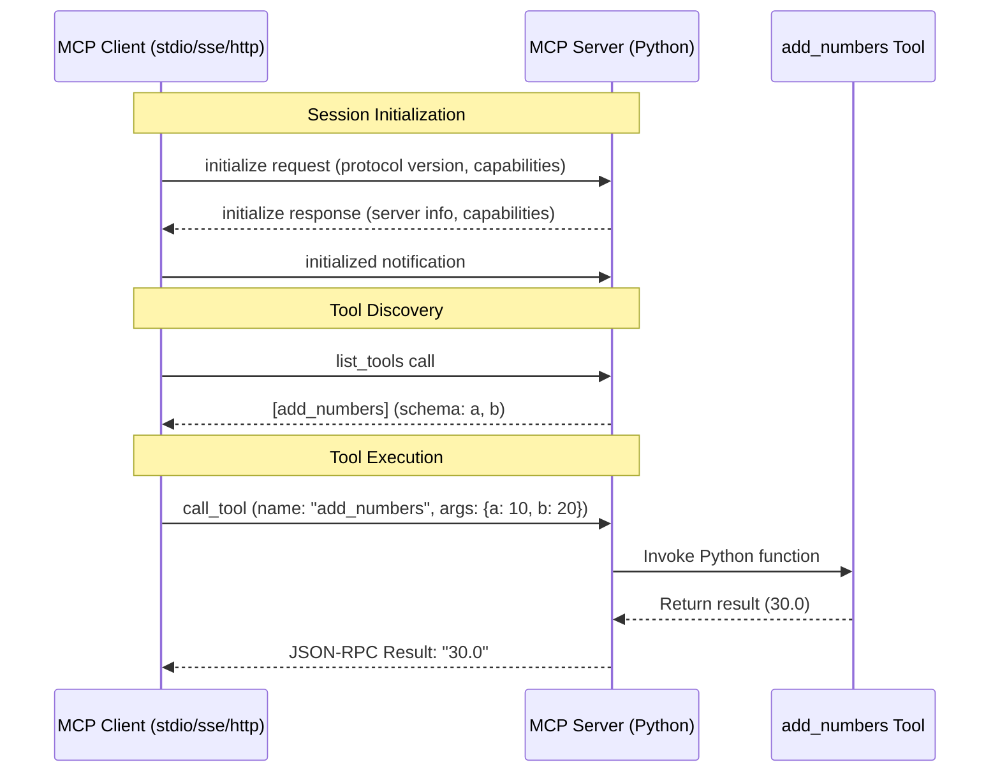

# MCP Example: Technical & Functional Documentation

This project demonstrates a multi-transport Model Context Protocol (MCP) server implemented in Python, along with three reference clients.

## 1. Functional Overview: Simple MCP Demo

This project serves as a **Simple MCP Demo**, showcasing how the Model Context Protocol (MCP) enables seamless interaction between a server providing tools and various clients.

### Key Features
- **Plug-and-Play Tooling**: A simple calculator-like tool (`add_numbers`) that can be plugged into any MCP-compliant environment (like the Claude Desktop app or the MCP Inspector).
- **Multi-Client Support**: Demonstration of how a single server can serve clients over local pipes (stdio) or over the network (SSE/HTTP).
- **Standardized Discovery**: Automatic tool schema discovery so clients know exactly what inputs are needed without manual configuration.

### The Tool: `add_numbers`
The demo focuses on one functional unit:
- **Operation**: A basic addition service.
- **Input Parameters**: 
  - `a`: First numeric value.
  - `b`: Second numeric value.
- **Output**: A plain-text result (e.g., `30.0`).
- **User Experience**: From a user's perspective (e.g., in the MCP Inspector), it appears as a simple web form or a chat command that "just works" by calling the underlying Python logic.

## 2. Technical Architecture

The system is built using the **Python MCP SDK** and follows the JSON-RPC 2.0 based protocol defined by MCP.

### Tech Stack
- **Language**: Python 3.10+
- **Core Library**: `mcp` (Official SDK)
- **Web Server**: `Starlette` + `Uvicorn` (for SSE and HTTP transports)
- **Serialization**: JSON-RPC over various streams.

### Transport Mechanisms
1.  **Standard I/O (stdio)**: 
    - The server reads from `stdin` and writes to `stdout`. 
    - This is the default transport used by the **MCP Inspector** and most LLM host applications (like Claude Desktop).
2.  **Server-Sent Events (SSE)**:
    - Provides a persistent, unidirectional stream from server to client.
    - Client sends requests via standard POST requests to a `/messages` endpoint.
3.  **Streamable HTTP**:
    - A custom MCP transport that facilitates request/response streaming over standard HTTP connections, utilizing session IDs to maintain state.

## 3. Interaction Flow Diagram

## 4. Component Details

### Server (`server.py`)
- Uses `@app_server.list_tools()` decorator to register the tool schema.
- Uses `@app_server.call_tool()` decorator to handle logic execution.
- Dynamically switches transport logic based on the `--transport` flag.

### Clients
- **`client_stdio.py`**: Spawns the server as a subprocess and communicates via pipes.
- **`client_sse.py`**: Connects via a URL and manages a long-lived HTTP connection for events.
- **`client_http.py`**: Demonstrates the stateful session management required for streamable HTTP transport, including unpacking the `(read_stream, write_stream, session_id)` tuple.
